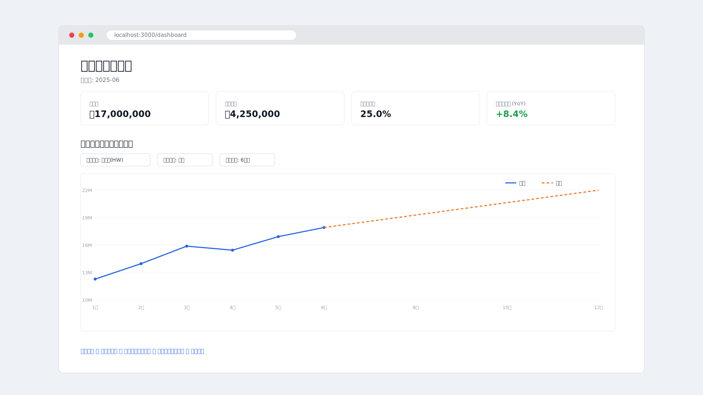

# financial-management（決算管理システム）

過去の財務データを取り込み・集計し、将来の推移を予測してグラフで可視化する決算管理システムです。

> **構築・起動方法は [`docs/operation.md`](docs/operation.md) に集約しています。**
> 仕様は [`docs/design.md`](docs/design.md)、CI/CD は [`docs/cicd.md`](docs/cicd.md)、変更履歴は [`docs/history.md`](docs/history.md)、開発タスクは [`docs/task.md`](docs/task.md) を参照してください。

---

## デモ画面

ダッシュボード（1920×1080）のイメージです。KPI カードと、売上の実績＋将来予測の推移グラフを表示します。



> 上図はレイアウトを示すイメージ図です。実機のスクリーンショットは、ローカルでアプリと DB を起動した状態で次のコマンドで生成できます（`docs/images/dashboard.png` に出力）。
>
> ```bash
> cd app/web
> npm run e2e:install                 # 初回のみ: ブラウザ導入
> docker compose -f ../../platform/docker-compose.yml up -d db
> npm run db:migrate && npm run db:seed
> npm run build && npm run start &    # アプリ起動
> npm run screenshot                  # 1920×1080 で撮影 → docs/images/dashboard.png
> ```
>
> 生成後、上の画像参照を `docs/images/dashboard.png` に差し替えてください。

---

## 1. 概要

| 項目 | 内容 |
| --- | --- |
| システム名 | 決算管理システム（financial-management） |
| 目的 | 過去の決算・財務データを蓄積し、集計・将来予測を行い、経営判断に資するグラフを提供する |
| 想定ユーザー | 経営者、経理・財務担当、経営企画 |
| 提供形態 | Web アプリケーション（PC ブラウザ中心、タブレット対応） |

### 解決したい課題
- Excel での手作業集計に依存しており、月次・年次の推移把握に時間がかかる
- 過去データから将来を見通す予測がブラックボックス化・属人化している
- 経営会議用のグラフ・レポート作成に工数がかかる

---

## 2. 機能要件

### 2.1 データ管理
- **データ取り込み**
  - CSV / Excel ファイルのインポート（勘定科目別の月次・年次データ）
  - 手入力フォームによる実績データ登録・編集
  - 会計期間（年度・四半期・月次）の定義と紐付け
- **マスタ管理**
  - 勘定科目マスタ（売上高、売上原価、販管費、営業利益 等）
  - 部門・事業セグメントマスタ
  - 会計年度・期間マスタ

### 2.2 集計
- 月次 / 四半期 / 年次での自動集計
- PL（損益計算書）系指標の算出：売上総利益、営業利益、経常利益、当期純利益
- 主要経営指標の算出：売上総利益率、営業利益率、前年同月比（YoY）、前月比（MoM）、累計（YTD）
- 部門別・セグメント別の内訳集計とドリルダウン

### 2.3 将来予測
- 過去実績に基づく将来推移の予測（売上・利益など）
- 予測モデル（段階的に高度化）
  - フェーズ1：移動平均・線形回帰・前年同期比成長率ベース
  - フェーズ2：季節性を考慮した時系列予測（指数平滑法 / Holt-Winters、Prophet 等）
- 予測期間（先 N か月／N 年）と予測手法の切り替え
- シナリオ比較（楽観・標準・悲観）

### 2.4 可視化（グラフ表示）
- 推移グラフ（折れ線・棒・複合グラフ）：実績と予測を同一チャートで表示
- 構成比グラフ（円・積み上げ棒）
- ダッシュボード：主要 KPI のサマリー表示
- 期間・部門・指標でのフィルタリング
- グラフ／表のエクスポート（PNG・PDF・CSV）

### 2.5 レポート
- 月次・四半期・年次レポートの自動生成
- 予実対比レポート（予算 vs 実績 vs 予測）

---

## 3. 非機能要件

| 区分 | 要件 |
| --- | --- |
| 性能 | 主要画面の表示は通常データ量で 2 秒以内。集計バッチは夜間に完了 |
| セキュリティ | 認証（ID/パスワード + 多要素認証）、ロールベースアクセス制御（RBAC）、通信の TLS 暗号化、監査ログ |
| 可用性 | 平日業務時間帯の稼働率 99.5% を目標 |
| データ保全 | 日次バックアップ、データ保持期間の設定 |
| 拡張性 | 勘定科目・部門・指標の追加に柔軟に対応できるデータモデル |
| 監査性 | データ変更履歴の記録（誰が・いつ・何を変更したか） |

---

## 4. システム構成

```
[ブラウザ / SPA]
      │ HTTPS (REST / JSON)
      ▼
[Next.js バックエンド API (Route Handlers /api/*)]
   ├─ 認証・認可
   ├─ 集計サービス
   ├─ 予測サービス
   └─ レポート生成
      │
      ▼
[データベース (PostgreSQL / Prisma)]
```

### プロジェクト構成（モノレポ）

```
.
├── app/                 # アプリケーションのソースコード
│   ├── web/             # Web（Next.js: フロントエンド + バックエンド API）
│   └── mobile/          # モバイル（Expo / React Native）
├── platform/            # 実行基盤（Docker など）
│   ├── docker/
│   ├── docker-compose.yml
│   └── .env.example
└── docs/                # ドキュメント
    ├── design.md        # 仕様
    ├── history.md       # 変更履歴
    └── task.md          # 開発タスク
```

---

## 5. 技術スタック選定

> 選定方針：データ集計・時系列予測・リッチなグラフ表示という要件に対し、**エコシステムが豊富で、予測ライブラリ（時系列分析）を扱いやすい構成**を優先。学習コストと保守性のバランスも考慮。

### 5.1 フロントエンド

| 技術 | 選定理由 |
| --- | --- |
| **TypeScript** | 型安全により大規模化・保守性を確保 |
| **React + Next.js** | コンポーネント志向・SSR/SSG対応。ダッシュボード UI に適し、エコシステムが充実 |
| **Recharts / Chart.js** | 推移・構成比など決算グラフを宣言的に実装可能。実績＋予測の複合表示に対応 |
| **TanStack Query** | サーバー状態のキャッシュ・取得管理 |
| **Tailwind CSS / shadcn/ui** | ダッシュボード UI を効率的に構築 |

### 5.2 バックエンド

| 技術 | 選定理由 |
| --- | --- |
| **Next.js（App Router の Route Handlers）** | **フロントエンドと同一プロジェクト・同一言語（TypeScript）で API を提供**できるため、開発・型共有・運用が一本化。Web とモバイルの両方から `/api/*` を利用する |
| **Zod** | API 入出力のバリデーション・型安全 |
| **Prisma** | 型安全な ORM とマイグレーション管理 |

> バックエンドは **Next.js に一本化**する（`app/web/src/app/api/*`）。集計・予測ロジックは TypeScript で実装する（`src/lib`）。将来、季節性を考慮した高度な時系列予測が必要になった場合は、予測処理のみ Python マイクロサービスとして分離する選択肢も残す。

### 5.3 データベース

| 技術 | 選定理由 |
| --- | --- |
| **PostgreSQL** | トランザクション整合性・集計クエリ（ウィンドウ関数等）に強く、財務データの正確性要件に適合。時系列拡張（TimescaleDB）への発展も可能 |

### 5.4 インフラ / 運用

| 技術 | 選定理由 |
| --- | --- |
| **Docker / Docker Compose** | 開発・本番環境の差異を吸収 |
| **クラウド（AWS / GCP）** | マネージド DB・ストレージ・スケーラビリティ |
| **GitHub Actions** | CI/CD（テスト・ビルド・デプロイの自動化） |

### 5.5 構成サマリー

| レイヤー | 採用技術 |
| --- | --- |
| Web フロントエンド | TypeScript / React / Next.js / Recharts |
| バックエンド | **Next.js (Route Handlers) / TypeScript / Zod / Prisma** |
| モバイル | Expo / React Native / Victory Native |
| データベース | PostgreSQL |
| インフラ | Docker / クラウド / GitHub Actions |

---

## 6. データモデル（概略）

- **accounts**（勘定科目マスタ）：id, code, name, category（売上/原価/費用/利益 …）
- **departments**（部門マスタ）：id, name, parent_id
- **periods**（会計期間）：id, fiscal_year, quarter, month
- **financial_records**（実績データ）：id, account_id, department_id, period_id, amount
- **forecasts**（予測データ）：id, account_id, period_id, method, scenario, amount
- **audit_logs**（監査ログ）：id, user_id, action, target, changed_at

---

## 7. 画面構成（主要画面）

1. ダッシュボード（主要 KPI サマリー・推移グラフ）
2. データ取り込み画面（CSV/Excel インポート・手入力）
3. 集計・分析画面（期間・部門フィルタ、ドリルダウン）
4. 将来予測画面（予測手法・期間・シナリオ設定とグラフ）
5. レポート画面（予実対比・出力）
6. マスタ管理画面（勘定科目・部門・期間）

---

## 8. 開発ロードマップ（案）

| フェーズ | 内容 |
| --- | --- |
| Phase 1 | データ取り込み・マスタ管理・基本集計・推移グラフ表示 |
| Phase 2 | 将来予測（移動平均・回帰）・ダッシュボード |
| Phase 3 | 高度な時系列予測（季節性）・シナリオ比較・レポート自動生成 |
| Phase 4 | 権限管理強化・監査ログ・エクスポート機能の拡充 |

---

## 9. 補足

本ドキュメントは要件定義および技術スタック選定の初版です。実際のデータ量・利用部門・既存会計システムとの連携要否に応じて、技術選定（特にバックエンド言語・DB・予測手法）は見直す前提とします。
