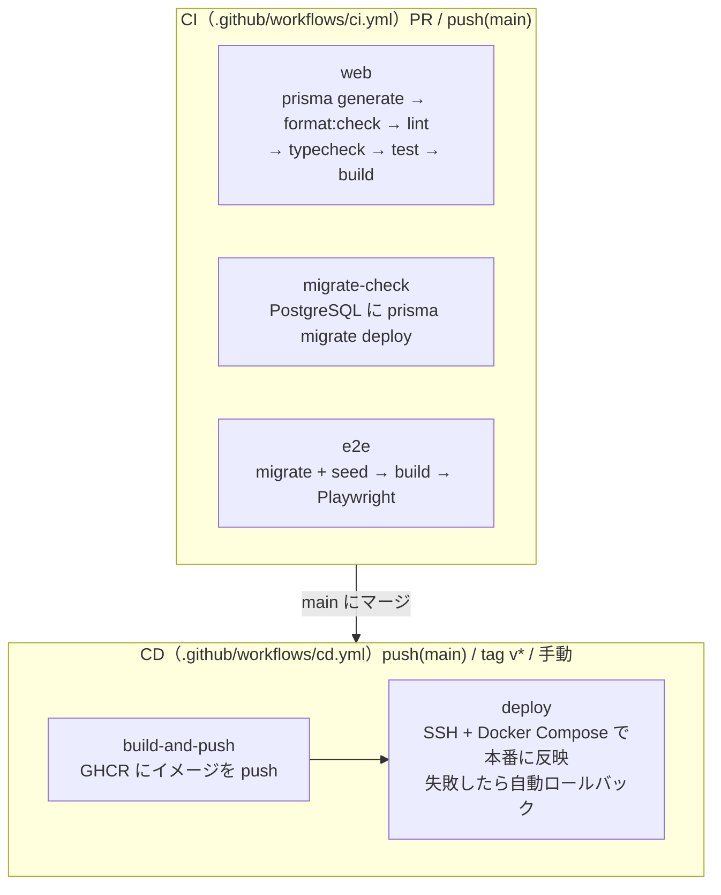

# CI/CD の設計（cicd.md）

カケイカイケイの継続的インテグレーション（CI）／継続的デリバリー（CD）の構成と運用方針をまとめる。
ローカルでの実行手順は [readme 18.7節](../../readme.md#187-クイックスタート)、デプロイの詳細は [`deploy.md`](deploy.md) を参照。

---

## 1. 全体像



- **CI**：変更のたびに品質ゲート（整形・lint・型・テスト・ビルド・マイグレーション・E2E）を実行する。
- **CD**：`main` への取り込み・リリースタグで Docker イメージを作り、本番へ配信する。

---

## 2. CI（`.github/workflows/ci.yml`）

### トリガー
- `pull_request`（すべての PR）
- `push`（`main` ブランチ）

### ジョブ
すべて `app/web` で、Node.js 22（`actions/setup-node` の npm キャッシュつき）を使う。

| ジョブ | 目的 | 主なステップ |
| --- | --- | --- |
| `web` | アプリの品質ゲート | `npm ci` → `prisma generate` → `format:check` → `lint` → `typecheck` → `test` → `build` |
| `migrate-check` | マイグレーションの健全性 | PostgreSQL（`postgres:16-alpine`）を起動し `prisma migrate deploy` → `prisma generate` |
| `e2e` | 画面の通しテスト | PostgreSQL で `migrate deploy` + `db:seed` → `build` → Playwright（chromium）。レポートを artifact に7日保存 |

### ポイント
- `web` ジョブのビルドは DB に接続しないので、`DATABASE_URL` はダミーでよい。
- 結合テスト（`npm run test:integration`）は実際の DB が要るため、CI では実行しない。
- ローカルで同じ確認をするには、`app/web` で次を実行する。

  ```bash
  npm run format:check && npm run lint && npm run typecheck && npm test && npm run build
  ```

---

## 3. 自動テスト

| 種類 | 設定 | 対象 | 実行 |
| --- | --- | --- | --- |
| 単体 | `app/web/vitest.config.ts` | `src/**/*.test.ts`（`*.integration.test.ts` を除く）。主に `src/lib/` のドメインロジックと API | `npm test`（CI）/ `npm run test:watch` |
| 結合 | `app/web/vitest.integration.config.ts` | `src/**/*.integration.test.ts`（テナント分離、売掛・買掛の消込、明細からの仕訳、減価償却・棚卸の仕訳、多要素認証のチャレンジ）。`.env` の `DATABASE_URL` の DB を使い、直列で実行する | `npm run test:integration`（ローカルのみ） |
| E2E | `app/web/playwright.config.ts` | `app/web/e2e/*.spec.ts` | `npm run e2e`（初回は `npm run e2e:install`） |

E2E の内容：

- `auth.spec.ts`：認証ガード（未ログイン時のリダイレクト、ログイン画面、誤った資格情報）。
- `dashboard.spec.ts`：ログインからダッシュボード（KPI・推移グラフ、予測手法の切り替え）、実績管理への遷移まで。初期データが要る。
- `deficit-warning.spec.ts`：黒字の月は警告を出さず、赤字の月は KPI カードと月次サマリーに警告を出すこと。

`playwright.config.ts` の `webServer` は `npm run start` で本番ビルドを起動する。`E2E_BASE_URL` を設定すると、起動済みのアプリに対して実行する。

---

## 4. CD（`.github/workflows/cd.yml`）

### トリガー
- `push`（`main`）
- `push`（`v*` タグ）
- `workflow_dispatch`（手動）

### ジョブ
| ジョブ | 目的 |
| --- | --- |
| `build-and-push` | `platform/docker/web.Dockerfile` でイメージをビルドし、GHCR（`ghcr.io/<repo>/web`）へ push |
| `deploy` | 本番サーバーへ **SSH + Docker Compose** で反映（`environment: production`） |

### タグ付け（`docker/metadata-action`）
- ブランチ名（`main`）
- セマンティックバージョン（`v1.2.3` → `1.2.3`）
- コミット SHA

### deploy ジョブの処理
1. デプロイするイメージのタグを決める（`main` → `:main` / `vX.Y.Z` → `:X.Y.Z`）。
2. `platform/docker-compose.prod.yml` をサーバーへ scp で置く。
3. SSH で、稼働中のイメージ ID を控えてから `docker compose pull` → `up -d` → `docker compose run --rm web npx prisma migrate deploy`。
4. `/api/health` が応答するまで最大60秒待つ。成功したら `docker image prune -f`、失敗したら直前のイメージに戻して `exit 1`。
5. `HEALTHCHECK_URL` があれば、外からのヘルスチェックも行う。
6. `MAIL_TO` があれば、結果をメールで知らせる。

ヘルスチェック・自動ロールバック・Secrets の詳細は [`deploy.md`](deploy.md)、Secrets の登録手順は [runbooks/production-server-setup.md](../runbooks/production-server-setup.md) を参照。Secrets は **Environment（production）の Secrets** に登録する。

---

## 5. リリースの流れ

[runbooks/deploy-and-rollback.md](../runbooks/deploy-and-rollback.md) を参照。

---

## 6. データベースマイグレーションの運用

- 開発：`npm run db:migrate`（`prisma migrate dev`。マイグレーションを作って適用する）。
- CI：`migrate-check` と `e2e` で `prisma migrate deploy` を適用して確かめる。
- 本番：web の entrypoint と deploy ジョブの両方で `prisma migrate deploy` を実行する。
- スキーマを変えたら、マイグレーションのファイルを必ずコミットする。
- ロールバックではマイグレーションを戻さないので、スキーマの変更は後方互換を原則とする（[`deploy.md`](deploy.md) 5章）。

---

## 7. 関連ファイル

| パス | 役割 |
| --- | --- |
| `.github/workflows/ci.yml` | CI の定義 |
| `.github/workflows/cd.yml` | CD の定義 |
| `app/web/vitest.config.ts` / `app/web/vitest.integration.config.ts` | 単体・結合テストの設定 |
| `app/web/playwright.config.ts` / `app/web/e2e/` | E2E テスト |
| `platform/docker/web.Dockerfile` / `platform/docker/entrypoint.sh` | web のイメージと起動処理 |
| `platform/docker-compose.prod.yml` | 本番用の Compose |
| `platform/scripts/backup.sh` / `restore.sh` | バックアップと復元 |
